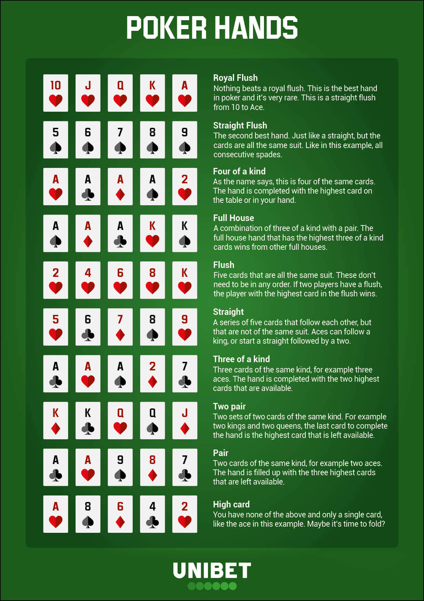

# Card Games

Enough with the [glorified ToDo lists and calculators](https://www.facebook.com/arturs.petersons.908/posts/2532150770339997), it is time to create something real!

In the scope of this exercise you will:

- create a card game rule engine
- hopefully understand why SOLID and unit tests are important
- create a simplified card game logic accesible via an Web API

## Submission

⚠️ Your code must be submitted in a **PRIVATE** Github repository

⚠️ Each of the exercises listed below must be submitted in a new branch with the exact name as provided

⚠️ Exercise is completed when teacher approves your Pull Request

<details>
  <summary>SH**! I don't know how to play poker!!!11</summary>

Don't worry if you don't know the rules of poker, basically you must know how card ranking works and you are good to go.



You can watch [How to Play Poker @youtube.com/PokerVIP](https://www.youtube.com/watch?v=GAoR9ji8D6A) as well, but ignore the betting part as it is not needed in this exercise.

</details>

## Exercises

<details>
  <summary>Exercise #1</summary>

**Branch name:** _feature/texas-holdem-engine-01_

---

✔️ your code **MUST** be covered with unit tests (it is advised to use [TDD](https://www.youtube.com/watch?v=AoIfc5NwRks))

✔️ try to apply [SOLID](https://en.wikipedia.org/wiki/SOLID) principles where possible, it will save you a lot of time

---

The details of Texas Hold'em hand values are available on [Wikipedia @wiki/Texas hold 'em](https://en.wikipedia.org/wiki/Texas_hold_%27em#Sample_showdown)

The input is to be read from standart input in the form of:

```
<3-5 board cards> <hand 1> <hand 2> <...> <hand N>
```

where:

```
- <3-5 board cards> is a 6-10 character string where each 2 characters encode a card
- <hand X> is a 4 character string where each 2 characters encode a card, with 2 cards per hand
- <card> is a 2 character string with the first character representing the rank (one of "A", "K", "Q",
"J", "T", "9", "8", "7", "6", "5", "4", "3", "2") and the second character representing the suit (one of
"h", "d", "c", "s") .
```

The output is to be written to standard output using the format:

```
<hand block 1> <hand block 2> <...> <hand block n>
```

where:

- <hand block 1> is the hand block with the weakest value
- <hand block 2> is the hand block with the second weakest value
- ... and so forth.
- <hand block n> is the hand block with the strongest value
- Each hand block consists of one or multiple hands (each represented by 4 character string with 2
  characters to encode a card, with 2 cards per hand) with equal strength
- In case there are multiple hands with the same value on the same board they should be ordered
  alphabetically and separated by "=" signs
- The order of the cards in each hand should remain the same as in the input, e.g., don't reorder
  `2h3s` into `3s2h`.

For example:

```
Input:
- 4cKs4h8s7s Ad4s Ac4d As9s KhKd 5d6d
- 2h3h4h5d8d KdKs 9hJh

Output:
- Ac4d=Ad4s 5d6d As9s KhKd
- KdKs 9hJh
```

</details>

<details>
  <summary>Exercise #2</summary>

**Branch name:** _feature/web-api-02_

---

✔️ you must validate each and every request when creating a Web API

---

Create a Web API for your card engine, it is NOT a game implementation but only exposed engine.

Example request and response:

_Request:_

`POST /engine/texas-holdem`

```json
{ "table": "4cKs4h8s7s", "hands": ["Ad4s", "Ac4d", "As9s", "KhKd", "5d6d"] }
```

_Response:_

```json
[
  { "hand": "Ad4s", "tie": true },
  { "hand": "Ac4d", "tie": true },
  { "hand": "As9s" },
  { "hand": "KhKd" },
  { "hand": "5d6d" }
]
```

</details>

<details>
  <summary>Exercise #3</summary>

**Branch name:** _feature/omaha-engine-03_

---

It is time to refactor your project a little bit!

Add one more game implementation following the steps in the first and second exercise, meaning - console app and Web API implementation.

You have two options to choose from:

- [Omaha @wiki/Omaha hold 'em](https://en.wikipedia.org/wiki/Omaha_hold_%27em)
- [Blackjack @wiki/Blackjack](https://en.wikipedia.org/wiki/Blackjack#Rules)

</details>

<details>
  <summary>Exercise #4</summary>

**Branch name:** _feature/texas-holdem-game-04_

Congratulations, you know how to create card game engine! Now it is time to create a simplified (without player actions) game as well.

New domain object is added to your application - `game`, `game` is given a card deck initially, knows game logic and uses your rule engine.

## Example game scenario #1:

**Game is started:**

_Request:_

`POST /games/texas-holdem/start?players=4`

_Response:_

```json
{ "id": 5, "hands": ["Ad4s", "Ac4d", "As9s", "KhKd"] }
```

**Three players are willing to continue game, first cards are dealt on the table:**

_Request:_

`POST /games/texas-holdem/5/flop`

```json
{ "hands": ["Ac4d", "As9s", "KhKd"] }
```

_Response:_

```json
{ "table": "4cKs4h", "hands": ["Ac4d", "As9s", "KhKd"] }
```

**Two players are willing to continue game, next card is dealt on the table:**

_Request:_

`POST /games/texas-holdem/5/turn`

```json
{ "hands": ["Ac4d", "As9s"] }
```

_Response:_

```json
{ "table": "4cKs4h8s", "hands": ["Ac4d", "As9s"] }
```

**Both players are willing to continue game, next card is dealt on the table:**

_Request:_

`POST /games/texas-holdem/5/river`

```json
{ "hands": ["Ac4d", "As9s"] }
```

_Response:_

```json
{ "table": "4cKs4h8s7s", "hands": ["Ac4d", "As9s"] }
```

**Showdown:**

_Request:_

`POST /games/texas-holdem/5/showdown`

```json
{ "hands": ["Ac4d", "As9s"] }
```

_Response:_

```json
{
  "hands": [{ "hand": "Ac4d" }, { "hand": "As9s" }]
}
```

## Example game scenario #2:

**Game is started:**

_Request:_

`POST /games/texas-holdem/start?players=4`

_Response:_

```json
{ "id": 5, "hands": ["Ad4s", "Ac4d", "As9s", "KhKd"] }
```

**Three players are willing to continue game, first cards are dealt on the table:**

_Request:_

`POST /games/texas-holdem/5/flop`

```json
{ "hands": ["Ac4d", "As9s", "KhKd"] }
```

_Response:_

```json
{ "table": "4cKs4h", "hands": ["Ac4d", "As9s", "KhKd"] }
```

**Player wins the game:**

_Request:_

`POST /games/texas-holdem/5/end`

```json
{ "hand": "Ac4d" }
```

## Additional endpoints for testing purposes

**Set card deck:**

If request is made before the start of the game, game will use passed card deck. Otherwise shuffled cards must be set as deck in the start of the game.

_Request:_

`POST /games/texas-holdem/testing/card-deck`

```json
{ "cards": ["2c", "3c", "4c", ...] }
```

</details>

<details>
  <summary>Exercise #5</summary>

**Branch name:** _feature/texas-holdem-game-history-05_

For security reasons game history must be present, which returns a history for a completed game.

## Example game scenario #1:

_Request:_

`GET /games/texas-holdem/5/history`

_Response:_

```json
{
  "preFlop": {
    "hands": ["Ad4s", "Ac4d", "As9s", "KhKd"]
  },
  "flop": {
    "table": "4cKs4h",
    "hands": ["Ac4d", "As9s", "KhKd"]
  },
  "turn": {
    "table": "4cKs4h8s",
    "hands": ["Ac4d", "As9s"]
  },
  "river": {
    "table": "4cKs4h8s7s",
    "hands": ["Ac4d", "As9s"]
  },
  "winners": ["Ac4d", "As9s"]
}
```

## Example game scenario #2:

_Request:_

`GET /games/texas-holdem/5/history`

_Response:_

```json
{
  "preFlop": {
    "hands": ["Ad4s", "Ac4d", "As9s", "KhKd"]
  },
  "flop": {
    "table": "4cKs4h",
    "hands": ["Ac4d", "As9s", "KhKd"]
  },
  "winners": ["Ac4d"]
}
```

</details>
